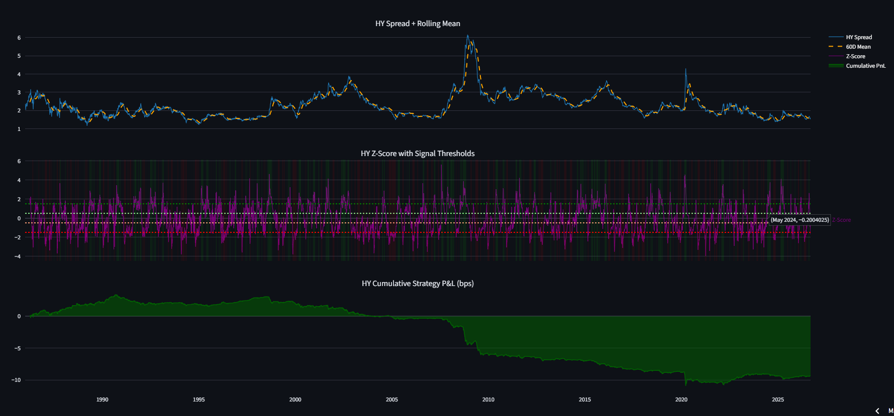
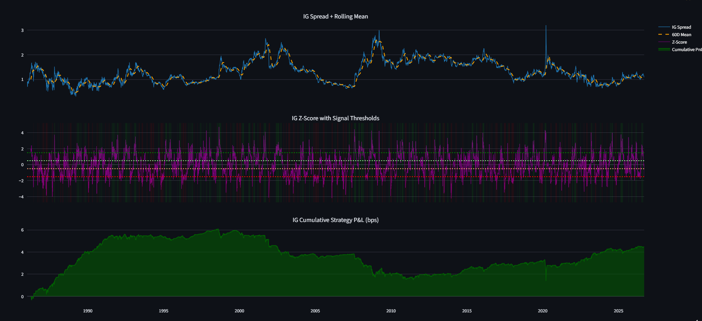
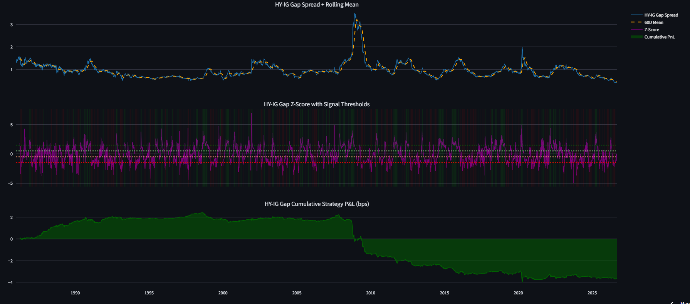

# Credit Spread Analyzer

A tool that monitors US corporate bond credit spreads, flags when they're unusually wide (cheap) or tight (rich) relative to their own recent history and backtests a simple mean-reversion trading strategy on that signal.

**Live app:** https://credit-spread-analyzer.streamlit.app/


High Yield spread shows the riskiest corporate bonds, most sensitive to market fear.

Investment Grade spread shows safer corporate bonds, moves less but still reacts to stress.

The gap between HY and IG isolates credit-specific panic from general rate moves.

## What is a credit spread?

A credit spread is the extra yield a corporate bond pays over a comparable US Treasury bond, to compensate investors for the risk that the company (unlike the government) could default. When spreads widen, the market is pricing in more risk, that is, bonds get cheaper. When spreads tighten, the market is confident and bonds get more expensive.

This project tracks three things:
- **HY spread** (`BAA10Y`) — Moody's Baa-rated corporate spread over the 10-year Treasury
- **IG spread** (`AAA10Y`) — Moody's Aaa-rated corporate spread over the 10-year Treasury
- **HY-IG gap** — the difference between them, which isolates credit-specific stress from general rate moves

## What the tool does

1. **Fetches** ~26 years of daily data from the FRED API (`data_fetcher.py`)
2. **Computes a rolling 60-day Z-score** for each series, it checks how many standard deviations today's spread is from its own recent average (`spread_analyzer.py`)
3. **Generates a signal**: CHEAP (Z > 1.5), RICH (Z < -1.5), or NEUTRAL
4. **Backtests** a simple strategy is to enter at ±1.5σ, exit at ±0.5σ (`backtester.py`)
5. **Displays everything** on a live Streamlit dashboard, refreshed on every page load

## How the Z-score signal works

Raw spread levels aren't comparable across time, so, what's "normal" in a calm market is very different from what's "normal" during a recession. The Z-score fixes this by asking: *relative to the last 60 trading days, how unusual is today?*

```
z = (today's spread − 60-day average) / 60-day standard deviation
```

A Z-score of 0 means today looks exactly like the recent average. ±1.5 is used as the entry threshold — statistically, about 87% of values fall within ±1.5 standard deviations under a normal distribution, so this flags genuine outliers rather than everyday noise.

## What the backtest actually showed

| Series | Total PnL (bps) | Sharpe Ratio | Max Drawdown (bps) | Win Rate | Trades |
|---|---|---|---|---|---|
| HY | -9.3 | -0.51 | -14.3 | 47.6% | 451 |
| IG | +4.5 | 0.25 | -4.7 | 51.5% | 540 |
| HY-IG Gap | -3.7 | -0.31 | -6.4 | 48.6% | 530 |

**Takeaway: the naive strategy doesn't work well out of the box.** HY and the HY-IG gap trade were both net negative over the full backtest period; IG was only marginally positive. None of these show a Sharpe ratio that would justify real capital.

A likely reason: a rolling 60-day Z-score is *relative to its own recent window only*. If spreads sit at an unusually calm or unusually stressed level for a long stretch (months to years), the model adapts to that as "normal" and stops flagging it. It can miss slow regime shifts that would look extreme against a longer history. With 450-540 trades over the period and no transaction costs modeled, real-world costs would likely make the results worse, not better.

## Tech

Python, pandas, FRED API (`fredapi`), Plotly, Streamlit, deployed on Streamlit Community Cloud with GitHub Actions for scheduled data refreshes.

## Project structure

```
credit_spread_analyzer/
├── .github/workflows/
│   └── daily_run.yml      # Scheduled daily data refresh via GitHub Actions
├── data_fetcher.py        # Pulls data from FRED, computes derived columns
├── spread_analyzer.py     # SpreadData, ZScoreSignal, SignalReport classes
├── backtester.py          # Backtester class — position logic, PnL, Sharpe, drawdown
├── dashboard.py           # Plotly dashboard builder (shared by main.py and streamlit_app.py)
├── streamlit_app.py       # Live web app
├── main.py                # Command-line version — fetch, signal, backtest, save HTML dashboards
├── requirements.txt       # Python dependencies
└── LICENSE
```

To run locally, you'll also need a `config.py` with your own FRED API key (not included — get a free key at fred.stlouisfed.org):
```python
FRED_API_KEY = "your_key_here"
```


